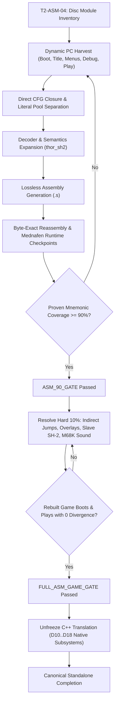

# ASM Recovery Autoplan & Priority Engine

This document defines the live autonomous execution engine and priority queue for completing *The Story of Thor 2 / The Legend of Oasis* recovery to canonical completion.

---

## 1. Autonomous Progression Sequence

---

## 2. Priority Scoring Formula

Candidate blocks and analysis tracks are prioritized using the following cost-benefit heuristic:

$$\text{Priority}(R) = \frac{\Delta \text{ProvenBytes}(R) \times \text{ConfidenceLevel}(R)}{\text{VerificationCost}(R)}$$

Where:
- $\Delta \text{ProvenBytes}(R)$: Number of unclassified or raw bytes converted into proven code/data.
- $\text{ConfidenceLevel}(R)$:
  - $1.0$ for dynamically executed traces (`EXECUTED`);
  - $0.9$ for direct deterministic CFG closure from executed roots;
  - $0.6$ for compiler idiom / static heuristic patterns.
- $\text{VerificationCost}(R)$: Computational and oracle runtime required to verify the range.

---

## 3. Anti-Gaming Metrics & Invariants

To maintain scientific integrity across all metric reporting:
1. **Denominator Integrity:** $\text{CONFIRMED\_CODE}$ is the denominator for $\text{PROVEN\_MNEMONIC\_COVERAGE}$. It is never artificially deflated by reclassifying unexecuted blocks as DATA without positive structural evidence (e.g. PC-relative literal pool references).
2. **Lossless Instruction Integrity:** Raw `.byte` emissions in assembly files NEVER count as proven mnemonics. Only decoded SH-2 mnemonics emitted with verified L0 semantics count toward the numerator.
3. **Fail-Closed Gate Checks:** If a rebuilt module has even 1 byte difference from original retail bytes, reassembly is marked `FAILED`.
4. **Zero-Divergence Runtime Gate:** In Mednafen runtime parity checks, all general registers (R0-R14, SP/R15, PC, PR, GBR, VBR, MACH, MACL, SR) and cycle timing must match the baseline execution exactly.
