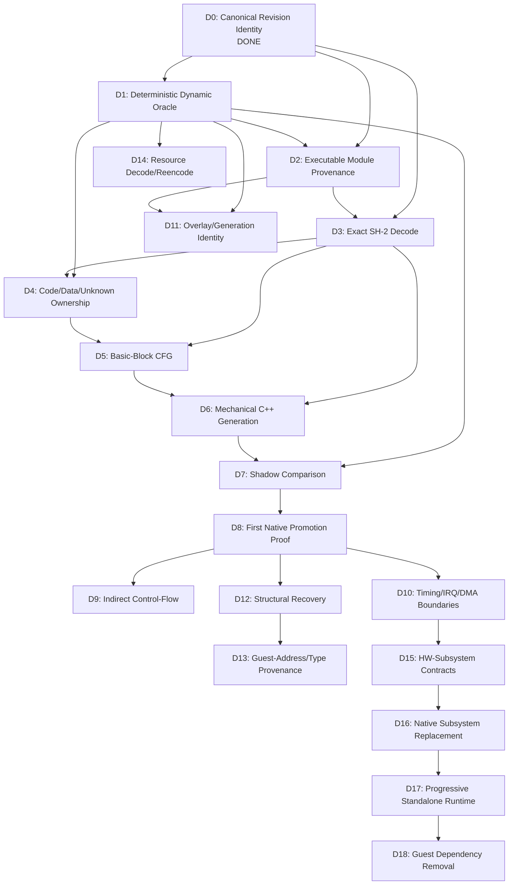

# Development Plan

Status: `ADOPTED`

This document defines the capability-oriented development sequence for The Story of Thor 2 native recovery. Each milestone describes what the project gains, not which external tool it imitates.

For the method/component experiment and adoption gates that feed into these milestones, see `PIPELINE_VALIDATION_PLAN.md`.

## Planning audit summary

This plan was created during the T2-P0 planning checkpoint after completing T2-M0. The audit of the prior planning model found:

1. **ROADMAP.md milestones conflated capability with technology.** M1 was named after SaturnAutoRE rather than the capability (dynamic oracle). If SaturnAutoRE failed, the milestone appeared to fail, even though the capability was still needed.
2. **PIPELINE_VALIDATION_PLAN.md served as both development plan and verification plan.** The target chain was a single paragraph; the phases were verification experiments doubling as roadmap milestones.
3. **External projects were embedded in phase identity.** The capability should be primary; the external project is merely one candidate method.
4. **Phase ordering was partly historical, not dependency-driven.** Some phases could be reordered based on actual dependencies.
5. **Phase 8 (SaturnRecomp) bundled 8 independent sub-experiments** that are needed at very different times.
6. **Verification experiments had hidden prerequisites** not represented in the plan.
7. **No fallback routes were specified** for any development capability.
8. **ROADMAP.md and PIPELINE_VALIDATION_PLAN.md had overlapping scope** with no clear authority boundary.

This dual-track model separates development capabilities from verification experiments. A failed external method does not invalidate the development capability it was meant to enable.

## Plan status classification

Planning documents and their elements use these states:

- `PROPOSED` — initial idea, not yet tested or adopted.
- `VALIDATED` — experiment has demonstrated the concept on a Thor 2 slice.
- `ADOPTED` — project decision to include in the pipeline.
- `SUPERSEDED` — replaced by a newer plan or approach.
- `REJECTED` — tested and found unsuitable for Thor 2.
- `DEFERRED` — potentially useful but intentionally postponed.

`VALIDATED` describes evidence. `ADOPTED` describes a project decision. They are separate.

A development capability may be `ADOPTED` as necessary even when the proposed method for achieving it is `REJECTED`.

## Dependency overview



### Dependency groups

**Core translation chain** (sequential critical path):
D0 → D1 → D2 → D3 → D4 → D5 → D6 → D7 → D8

**Scaling and hardening** (after D8):
D9 (indirect flow), D10 (timing boundaries), D11 (overlays)

**Recovery** (after D8):
D12 (structural), D13 (type provenance)

**Resource track** (parallel, after D1):
D14 (resource decode/reencode)

**Hardware track** (after D1 + D10):
D15 (contract discovery), D16 (native replacement)

**Integration** (final stages):
D17 (standalone runtime), D18 (guest removal)

Note: D11 (overlay detection) may need to move earlier if D2 discovers runtime code replacement.

### Critical path to first mechanical proof (D8)

For a single basic-block proof, not all milestones need full completion:

1. D0 provides the bytes and candidate load addresses. (DONE)
2. D1 provides a reproducible oracle and confirms execution. (one observation sufficient)
3. D2 is partially satisfied by M0 static evidence for `0TH2.BIN` at `0x06004000`; D1 confirms dynamically.
4. D3 needs only the opcodes in the target block, not full decoder coverage.
5. D4/D5 are satisfied for one block by dynamic execution evidence.
6. D6 generates C++ for that single block.
7. D7 compares against oracle.
8. D8 is the proof.

The first proof targets a RAM-only Master SH-2 block from `0TH2.BIN` without MMIO, DMA, or interrupt boundary crossings.

---

## Development milestones

### D0 — Canonical Revision Identity

```
ID:              D0
CAPABILITY:      Immutable, reproducible identification of the Thor 2 disc image and its files.
WHY REQUIRED:    Every later claim requires knowing exactly which bytes are being analyzed.
PREREQUISITES:   None.
INPUTS:          Private disc image.
DELIVERABLE:     Revision config, ISO9660 manifest with per-file SHA-256, boot metadata, executable candidate list.
WHAT MUST BE TRUE BEFORE START: Access to private disc image.
WHAT THIS MILESTONE DOES NOT ATTEMPT: Dynamic execution, code classification, semantic naming.
REQUIRED VERIFICATION GATE: Two independent census runs produce identical output.
FALLBACK / ALTERNATIVE ROUTE: N/A — foundational.
STATUS:          DONE (T2-M0, commit 5a0de2f)
```

### D1 — Deterministic Dynamic Oracle

```
ID:              D1
CAPABILITY:      Reproducible dynamic observation of Thor 2 execution: CPU state, PC, memory effects from a fixed starting state.
WHY REQUIRED:    All behavioral claims require dynamic proof. No translation can be verified without an authoritative execution path.
PREREQUISITES:   D0.
INPUTS:          Canonical disc image, emulator/instrumentation.
DELIVERABLE:     Environment producing deterministic execution traces; at least one reproducible observation.
WHAT MUST BE TRUE BEFORE START: D0 DONE; emulator candidate identified.
WHAT THIS MILESTONE DOES NOT ATTEMPT: Translation, boundary discovery, subsystem implementation, broad coverage.
REQUIRED VERIFICATION GATE: V-01 (or alternative oracle experiment).
FALLBACK / ALTERNATIVE ROUTE: If SaturnAutoRE fails, try raw Mednafen debugging, BizHawk, or another instrumented emulator.
STATUS:          PROPOSED
```

### D2 — Executable Module Provenance

```
ID:              D2
CAPABILITY:      Confirmed mapping: disc file → load address → runtime execution range.
WHY REQUIRED:    Must know what code is at what address before translating it. Without provenance, we cannot bind disc bytes to runtime behavior.
PREREQUISITES:   D0, D1 (dynamic confirmation).
INPUTS:          Disc manifest (D0), dynamic oracle traces (D1).
DELIVERABLE:     Provenance records for at least 0TH2.BIN and TH2.LOW; detection of any transformation/relocation.
WHAT MUST BE TRUE BEFORE START: D1 provides at least one dynamic observation confirming or falsifying a candidate mapping.
WHAT THIS MILESTONE DOES NOT ATTEMPT: Full overlay system implementation, resource decoding, code translation.
REQUIRED VERIFICATION GATE: V-02 (or alternative provenance method). V-10 contributes if transformation is detected.
FALLBACK / ALTERNATIVE ROUTE: Manual Mednafen tracing if Daytona-style model does not fit.
STATUS:          PROPOSED
```

### D3 — Exact SH-2 Decode

```
ID:              D3
CAPABILITY:      Correct decoding of all SH-2 instructions in the executed Thor 2 corpus.
WHY REQUIRED:    Translation requires correct instruction decode. Wrong decode = wrong translation.
PREREQUISITES:   D0 (bytes), D2 (confirmed code ranges with load addresses).
INPUTS:          Confirmed code ranges, SH-2 ISA documentation.
DELIVERABLE:     Decoder implementation tested against Thor 2 executed instruction corpus.
WHAT MUST BE TRUE BEFORE START: At least one confirmed code range with known load address.
WHAT THIS MILESTONE DOES NOT ATTEMPT: Translation to C++, semantic naming, function discovery.
REQUIRED VERIFICATION GATE: V-06 (cross-check with Catherine and/or other independent decoder).
FALLBACK / ALTERNATIVE ROUTE: Multiple independent reference decoders exist (Catherine, Mednafen internals, SH7604 manual).
STATUS:          PROPOSED
```

### D4 — Code/Data/Unknown Ownership

```
ID:              D4
CAPABILITY:      Per-byte classification of module contents as CONFIRMED_CODE, PROBABLE_CODE, UNKNOWN, PROBABLE_DATA, CONFIRMED_DATA, CODE_AND_DATA, or PADDING.
WHY REQUIRED:    Must distinguish code from data before translation. Translating data as code produces nonsense; skipping code produces gaps.
PREREQUISITES:   D3 (decoder), D1 (executed-range evidence).
INPUTS:          Decoded instruction streams, dynamic execution traces.
DELIVERABLE:     Classified ownership map for at least one module range.
WHAT MUST BE TRUE BEFORE START: Decoder working on the target range; at least one execution trace showing which PCs were fetched.
WHAT THIS MILESTONE DOES NOT ATTEMPT: Function boundary assignment, semantic naming, complete module coverage.
REQUIRED VERIFICATION GATE: V-03 (boundary discovery) and/or V-04 (segmentation schema).
FALLBACK / ALTERNATIVE ROUTE: Manual classification for small ranges; dynamic execution evidence alone classifies executed bytes as CONFIRMED_CODE.
STATUS:          PROPOSED
```

### D5 — Basic-Block CFG Construction

```
ID:              D5
CAPABILITY:      Control flow graph at basic-block granularity for confirmed code ranges.
WHY REQUIRED:    Translation unit is the basic block. Block boundaries must be known to generate correct C++.
PREREQUISITES:   D3 (decoded instructions), D4 (code ranges identified).
INPUTS:          Decoded code with ownership classification.
DELIVERABLE:     CFG for at least one bounded confirmed-code range.
WHAT MUST BE TRUE BEFORE START: Code ranges classified; decoder produces correct branch/jump targets.
WHAT THIS MILESTONE DOES NOT ATTEMPT: Function grouping, full indirect target resolution, semantic naming.
REQUIRED VERIFICATION GATE: Dynamic execution must agree with static CFG for observed paths.
FALLBACK / ALTERNATIVE ROUTE: Manual CFG construction for small ranges.
STATUS:          PROPOSED
```

### D6 — Mechanical Explicit-State C++ Generation

```
ID:              D6
CAPABILITY:      Generate C++ that preserves all SH-2 architectural state for basic blocks.
WHY REQUIRED:    Core capability — transform executed SH-2 code into verifiable native code.
PREREQUISITES:   D3 (decode), D5 (CFG/block boundaries).
INPUTS:          Decoded basic blocks with confirmed boundaries.
DELIVERABLE:     C++ source for at least one block preserving R0-R15, PC, SR, PR, GBR, VBR, MACH, MACL, and ordered memory effects.
WHAT MUST BE TRUE BEFORE START: At least one confirmed basic block with complete decode and known boundaries.
WHAT THIS MILESTONE DOES NOT ATTEMPT: Semantic naming, native type introduction, optimization, function-level grouping.
REQUIRED VERIFICATION GATE: V-07 (mechanical block promotion proof).
FALLBACK / ALTERNATIVE ROUTE: If code generation approach fails for a candidate, interpreter-only path remains authoritative.
STATUS:          PROPOSED
```

### D7 — Shadow Comparison Infrastructure

```
ID:              D7
CAPABILITY:      Run generated C++ alongside oracle and compare CPU/memory state after every block.
WHY REQUIRED:    Verification requires automated comparison — manual state checking does not scale.
PREREQUISITES:   D1 (oracle), D6 (generated C++).
INPUTS:          Generated C++ blocks, oracle execution path.
DELIVERABLE:     Infrastructure that detects any divergence in CPU state or memory effects.
WHAT MUST BE TRUE BEFORE START: At least one generated block and working oracle.
WHAT THIS MILESTONE DOES NOT ATTEMPT: Automatic divergence repair, broad coverage, optimization.
REQUIRED VERIFICATION GATE: Part of V-07.
FALLBACK / ALTERNATIVE ROUTE: Manual state comparison for very small initial proofs if infrastructure is blocked.
STATUS:          PROPOSED
```

### D8 — First Native Promotion Proof

```
ID:              D8
CAPABILITY:      One basic block executing natively with zero divergence from oracle.
WHY REQUIRED:    Central proof that the project methodology works. Without this, everything downstream is speculative.
PREREQUISITES:   D6 (generated C++), D7 (shadow comparison).
INPUTS:          Shadow-verified block with zero divergence.
DELIVERABLE:     Proof that native execution produces identical state to oracle for one block.
WHAT MUST BE TRUE BEFORE START: Shadow comparison shows zero divergence for the candidate block.
WHAT THIS MILESTONE DOES NOT ATTEMPT: Broad coverage, optimization, semantic recovery, multi-block chaining.
REQUIRED VERIFICATION GATE: V-07 (this IS the proof).
FALLBACK / ALTERNATIVE ROUTE: If the first block candidate fails, try a simpler block. If ALL blocks fail, re-examine decode/generation/oracle correctness.
STATUS:          PROPOSED
```

### D9 — Indirect Control-Flow Handling

```
ID:              D9
CAPABILITY:      Strategy for blocks containing indirect jumps, calls, or computed branches.
WHY REQUIRED:    Real game code uses jump tables, function pointers, and vtable-like dispatches. These cannot be statically resolved.
PREREQUISITES:   D8 (basic proof first), D1 (dynamic target observation).
INPUTS:          Dynamic traces showing indirect target sets, static analysis of jump table patterns.
DELIVERABLE:     Runtime dispatch mechanism or evidence-based target resolution for at least one indirect-flow block.
WHAT MUST BE TRUE BEFORE START: Basic promotion proof exists for direct-flow blocks.
WHAT THIS MILESTONE DOES NOT ATTEMPT: Complete target-set resolution (UNKNOWN targets stay on interpreter/fallback).
REQUIRED VERIFICATION GATE: At least one indirect-flow block handled correctly in shadow comparison.
FALLBACK / ALTERNATIVE ROUTE: Interpreter fallback for all indirect flow until evidence is sufficient.
STATUS:          PROPOSED
```

### D10 — Timing/Interrupt/DMA Execution Boundaries

```
ID:              D10
CAPABILITY:      Classification of blocks that cross timing-sensitive or non-atomic boundaries.
WHY REQUIRED:    A block assumed atomic might be interrupted; DMA can modify memory asynchronously; device-visible writes have timing requirements.
PREREQUISITES:   D1 (can observe interrupts/DMA), D8 (basic proof exists).
INPUTS:          Dynamic traces showing interrupt entry points, DMA register access patterns, device-visible write timing.
DELIVERABLE:     Policy for handling non-atomic blocks; classification of which execution ranges are timing-sensitive.
WHAT MUST BE TRUE BEFORE START: Dynamic oracle can observe interrupt/DMA patterns.
WHAT THIS MILESTONE DOES NOT ATTEMPT: Full Saturn timing model; subsystem replacement.
REQUIRED VERIFICATION GATE: Timing-sensitive blocks handled without divergence in shadow comparison.
FALLBACK / ALTERNATIVE ROUTE: Conservative fallback for all timing-sensitive blocks.
STATUS:          PROPOSED
```

### D11 — Overlay/Generation Identity

```
ID:              D11
CAPABILITY:      Detection and handling of runtime code replacement at a given address.
WHY REQUIRED:    If RAM is repopulated with different code, block identity must include generation. Without this, translated code may execute against wrong-generation data.
PREREQUISITES:   D1 (dynamic oracle), D2 (provenance model).
INPUTS:          Dynamic traces over extended gameplay showing memory content stability.
DELIVERABLE:     Evidence of whether Thor 2 uses code overlays; generation tracking model if so.
WHAT MUST BE TRUE BEFORE START: Oracle can trace extended gameplay beyond boot.
WHAT THIS MILESTONE DOES NOT ATTEMPT: Complete overlay map (incremental discovery); premature overlay handling for unobserved ranges.
REQUIRED VERIFICATION GATE: V-10 (transformed executable detection).
FALLBACK / ALTERNATIVE ROUTE: If no overlays found, model simplifies to stable identity. If found, generation tracking is added.
STATUS:          PROPOSED
```

Note: D11 position may shift earlier if D2 discovers runtime code replacement during provenance work.

### D12 — Structural Recovery

```
ID:              D12
CAPABILITY:      Evidence-backed function boundaries, call graphs, data structure identification.
WHY REQUIRED:    Moving from flat blocks to higher-level structures enables comprehension and more efficient translation.
PREREQUISITES:   D8 (proven mechanical base ensures correctness is not sacrificed for structure).
INPUTS:          Verified blocks, CFG, dynamic call traces, library signature candidates.
DELIVERABLE:     Function boundaries and call graph with evidence for at least one module range.
WHAT MUST BE TRUE BEFORE START: Mechanical translation proof exists; correctness is protected.
WHAT THIS MILESTONE DOES NOT ATTEMPT: Gameplay semantics, speculative naming without evidence.
REQUIRED VERIFICATION GATE: V-05 (Ghidra/signatures for library support); V-13 (AI-assisted recovery).
FALLBACK / ALTERNATIVE ROUTE: Manual analysis; address-based names retained until evidence supports semantic names.
STATUS:          PROPOSED
```

### D13 — Guest-Address/Type Provenance

```
ID:              D13
CAPABILITY:      Typed native structures that preserve original guest address provenance.
WHY REQUIRED:    Transitioning from flat guest memory to typed C++ structures is necessary for maintainability, but premature abstraction loses provenance and breaks verification.
PREREQUISITES:   D12 (structural recovery provides confirmed structures).
INPUTS:          Confirmed data structures with evidence.
DELIVERABLE:     Type system with GuestAddress/GuestPtr preserving provenance for at least one confirmed structure.
WHAT MUST BE TRUE BEFORE START: At least one structure has evidence-backed field identification.
WHAT THIS MILESTONE DOES NOT ATTEMPT: Premature abstraction of unknown structures; removal of guest address tracking.
REQUIRED VERIFICATION GATE: V-09 (Azel address provenance model).
FALLBACK / ALTERNATIVE ROUTE: Remain on flat guest addresses if typed views are premature.
STATUS:          PROPOSED
```

### D14 — Resource Decoding/Reencoding

```
ID:              D14
CAPABILITY:      Understand and byte-accurately round-trip game resources (graphics, audio, maps, scripts, text).
WHY REQUIRED:    A standalone native implementation must load and use game resources without the Saturn CD subsystem.
PREREQUISITES:   D0 (disc files), D1 (runtime observation of resource loading).
INPUTS:          Disc files, runtime resource-loading traces.
DELIVERABLE:     Byte-accurate decode/reencode for at least one resource type.
WHAT MUST BE TRUE BEFORE START: Can observe resource loading at runtime.
WHAT THIS MILESTONE DOES NOT ATTEMPT: Resource modification, enhancement, or format replacement.
REQUIRED VERIFICATION GATE: V-11 (round-trip proof); V-12 (patch differential mining for locating resources).
FALLBACK / ALTERNATIVE ROUTE: Keep resources as opaque binary blobs passed to emulated subsystems.
STATUS:          PROPOSED
```

Note: D14 can proceed on a parallel track after D1, independent of the core translation chain.

### D15 — Hardware-Subsystem Contract Discovery

```
ID:              D15
CAPABILITY:      Documented contracts for Saturn hardware subsystems as actually used by Thor 2.
WHY REQUIRED:    Native subsystem replacement requires knowing the exact contract. Building a general Saturn emulator is a non-goal.
PREREQUISITES:   D1 (dynamic oracle), D10 (timing/DMA boundary understanding).
INPUTS:          Extended dynamic traces of hardware register access, DMA patterns, interrupt behavior.
DELIVERABLE:     Documented contracts for VDP1, VDP2, SCU, SCSP/M68K, CD, SMPC as used by Thor 2.
WHAT MUST BE TRUE BEFORE START: Extended dynamic observation of hardware interaction available.
WHAT THIS MILESTONE DOES NOT ATTEMPT: Implementation of replacement subsystems; general Saturn hardware documentation.
REQUIRED VERIFICATION GATE: V-08 (SaturnRecomp component testing) for cross-reference; independent Saturn documentation for validation.
FALLBACK / ALTERNATIVE ROUTE: Keep emulated subsystems where contract is not yet understood.
STATUS:          PROPOSED
```

### D16 — Native Subsystem Replacement

```
ID:              D16
CAPABILITY:      Replace one Saturn hardware subsystem with a native implementation verified against oracle.
WHY REQUIRED:    Eventual standalone runtime requires native subsystems.
PREREQUISITES:   D15 (documented subsystem contract).
INPUTS:          Subsystem contract, oracle for verification.
DELIVERABLE:     Native implementation of one subsystem passing differential tests against oracle.
WHAT MUST BE TRUE BEFORE START: Subsystem contract documented and verified.
WHAT THIS MILESTONE DOES NOT ATTEMPT: All subsystems at once; premature optimization.
REQUIRED VERIFICATION GATE: Differential testing against oracle on representative Thor 2 workload.
FALLBACK / ALTERNATIVE ROUTE: Keep emulated subsystem.
STATUS:          PROPOSED
```

### D17 — Progressive Standalone Runtime

```
ID:              D17
CAPABILITY:      Game execution with measurably reduced emulator/oracle dependency.
WHY REQUIRED:    The project goal is a native implementation, not permanent emulator dependence.
PREREQUISITES:   Sufficient verified block coverage (D8+), at least one native subsystem (D16).
INPUTS:          Verified native blocks and subsystems.
DELIVERABLE:     Game execution path with reduced oracle dependency, quantified coverage.
WHAT MUST BE TRUE BEFORE START: Critical mass of verified blocks and at least one native subsystem.
WHAT THIS MILESTONE DOES NOT ATTEMPT: Complete emulator removal; areas not yet proven safe remain on fallback.
REQUIRED VERIFICATION GATE: V-14 (progressive standalone extraction).
FALLBACK / ALTERNATIVE ROUTE: Hybrid runtime with more emulator dependency where needed.
STATUS:          PROPOSED
```

### D18 — Guest CPU/Hardware Dependency Removal

```
ID:              D18
CAPABILITY:      Native game implementation without guest CPU/hardware emulation where proven safe.
WHY REQUIRED:    Final project goal.
PREREQUISITES:   D17 with sufficient proven coverage.
INPUTS:          Proven standalone runtime with quantified remaining dependencies.
DELIVERABLE:     Game running natively where proven safe; remaining dependencies documented.
WHAT MUST BE TRUE BEFORE START: Coverage and verification sufficient for safe removal in each area.
WHAT THIS MILESTONE DOES NOT ATTEMPT: Forced removal of dependencies that are not yet proven safe.
REQUIRED VERIFICATION GATE: L5 externally observable equivalence for removed dependencies.
FALLBACK / ALTERNATIVE ROUTE: Keep bounded emulator components where proof is insufficient.
STATUS:          PROPOSED
```

---

## Risk/proof map

For each critical uncertainty: when it becomes blocking and what can safely proceed before resolution.

### Master vs Slave SH-2 execution

```
RISK:            If Slave SH-2 executes game code, mechanical translation needs dual-CPU semantics.
WHY IT MATTERS:  Dual-CPU complicates scheduling, memory visibility, and verification.
EARLIEST POINT WE MUST RESOLVE IT: D1 — dynamic oracle can observe which CPUs execute game code.
WHAT EVIDENCE RESOLVES IT: Trace showing Slave SH-2 PC values executing game logic (or only bounded worker tasks, or never).
WHAT CAN SAFELY PROCEED BEFORE IT IS RESOLVED: All single-CPU mechanical work; first proof targets Master SH-2 only.
```

### Executable Low WRAM provenance

```
RISK:            TH2.LOW mapping to 0x002DA000 might be wrong, transformed, or relocated.
WHY IT MATTERS:  Second major code range; wrong mapping = wrong translation base.
EARLIEST POINT WE MUST RESOLVE IT: D2 — module provenance confirmation.
WHAT EVIDENCE RESOLVES IT: Dynamic trace: CD read → RAM write at 0x002DA000 → later instruction fetch from that range.
WHAT CAN SAFELY PROCEED BEFORE IT IS RESOLVED: All work on 0TH2.BIN (independent provenance from Saturn header).
```

### Overlays/runtime code replacement

```
RISK:            Code at a given address may change during gameplay.
WHY IT MATTERS:  Block identity must include generation if code changes; without this, translations may execute against wrong-generation content.
EARLIEST POINT WE MUST RESOLVE IT: D2 (discovered during provenance) or D11 (formalized).
WHAT EVIDENCE RESOLVES IT: Multiple traces at same PC range showing same or different instruction bytes over time.
WHAT CAN SAFELY PROCEED BEFORE IT IS RESOLVED: First proof on boot-time resident code (low overlay risk).
```

### Decompression/transformation before execution

```
RISK:            Disc file bytes may not equal runtime bytes if transformation occurs before execution.
WHY IT MATTERS:  Provenance model must include transformation nodes if disc ≠ RAM.
EARLIEST POINT WE MUST RESOLVE IT: D2.
WHAT EVIDENCE RESOLVES IT: Byte comparison of disc file extent with RAM content at candidate load address.
WHAT CAN SAFELY PROCEED BEFORE IT IS RESOLVED: 0TH2.BIN — first-read, likely direct-loaded by Saturn BIOS.
```

### Indirect control flow

```
RISK:            Jump tables, function pointers, and computed branches cannot be statically resolved.
WHY IT MATTERS:  Untranslated targets must remain on interpreter/fallback; complete static coverage is impossible.
EARLIEST POINT WE MUST RESOLVE IT: D9 (after first proof).
WHAT EVIDENCE RESOLVES IT: Dynamic traces showing indirect target sets; table analysis for jump tables.
WHAT CAN SAFELY PROCEED BEFORE IT IS RESOLVED: First proof uses direct-flow blocks only.
```

### Emulator/oracle correctness

```
RISK:            Mednafen may not match real Saturn hardware behavior.
WHY IT MATTERS:  If oracle is wrong, all behavioral proofs based on it are wrong.
EARLIEST POINT WE MUST RESOLVE IT: D1 (baseline) plus ongoing for critical semantics.
WHAT EVIDENCE RESOLVES IT: Match with Saturn documentation; independent emulator or real hardware comparison for critical semantics.
WHAT CAN SAFELY PROCEED BEFORE IT IS RESOLVED: Most work proceeds with documented emulator version; critical semantics get two independent checks.
```

### SH-2 decode/semantic correctness

```
RISK:            Incorrect instruction decode produces incorrect translation.
WHY IT MATTERS:  Foundation of all mechanical work.
EARLIEST POINT WE MUST RESOLVE IT: D3 + V-06.
WHAT EVIDENCE RESOLVES IT: Multiple independent decoders agree on the executed Thor 2 opcode corpus.
WHAT CAN SAFELY PROCEED BEFORE IT IS RESOLVED: Nothing involving translation.
```

### Interrupt/timing boundaries

```
RISK:            A block assumed atomic might be interrupted mid-execution by Saturn IRQ or VBlank.
WHY IT MATTERS:  If a translated block modifies state that an ISR expects to see partially updated, behavioral divergence occurs.
EARLIEST POINT WE MUST RESOLVE IT: D10 (after first proof on safe blocks).
WHAT EVIDENCE RESOLVES IT: Dynamic traces showing ISR entry points, frequencies, and which code ranges are interrupted.
WHAT CAN SAFELY PROCEED BEFORE IT IS RESOLVED: First proof on blocks that are part of main-loop game logic (unlikely to be interrupted mid-block).
```

### SCU DMA interaction

```
RISK:            DMA transfers modify memory asynchronously; code depending on DMA completion needs synchronization.
WHY IT MATTERS:  Translated code reading from a DMA destination before transfer completes would see stale data.
EARLIEST POINT WE MUST RESOLVE IT: D10/D15.
WHAT EVIDENCE RESOLVES IT: DMA register write patterns, completion polling, and interrupt-driven completion.
WHAT CAN SAFELY PROCEED BEFORE IT IS RESOLVED: All code that does not depend on DMA-destination memory.
```

### VDP1/VDP2 hardware-visible boundaries

```
RISK:            Graphics commands have specific timing requirements relative to VBlank and HBlank.
WHY IT MATTERS:  Incorrect VDP register access timing produces visual glitches or hangs.
EARLIEST POINT WE MUST RESOLVE IT: D15.
WHAT EVIDENCE RESOLVES IT: VDP register access patterns correlated with VBlank/HBlank timing.
WHAT CAN SAFELY PROCEED BEFORE IT IS RESOLVED: All non-VDP code translation.
```

### M68K/SCSP dependence

```
RISK:            Sound system runs on separate CPU (68000) with its own program.
WHY IT MATTERS:  SH-2 → M68K communication has specific synchronization; native audio requires understanding the M68K program.
EARLIEST POINT WE MUST RESOLVE IT: D15.
WHAT EVIDENCE RESOLVES IT: Communication register patterns, M68K program identity, SCSP configuration.
WHAT CAN SAFELY PROCEED BEFORE IT IS RESOLVED: All SH-2 game logic translation (sound can remain emulated).
```

### CD streaming

```
RISK:            CD access has latency and buffering that game code may depend on.
WHY IT MATTERS:  Native runtime needs an alternative to the Saturn CD subsystem.
EARLIEST POINT WE MUST RESOLVE IT: D15.
WHAT EVIDENCE RESOLVES IT: CD access patterns (sector reads, streaming setup, status polling).
WHAT CAN SAFELY PROCEED BEFORE IT IS RESOLVED: All non-CD code; CD can remain emulated.
```

### Legal/private artifact handling

```
RISK:            Accidentally committing copyrighted material to GitHub.
WHY IT MATTERS:  Legal compliance is priority 1. Repository purge would be disruptive.
EARLIEST POINT WE MUST RESOLVE IT: Already resolved (D-001, .gitignore).
WHAT EVIDENCE RESOLVES IT: .gitignore covers binary extensions; external/README.md documents rules; every commit reviewed.
WHAT CAN SAFELY PROCEED BEFORE IT IS RESOLVED: Always safe with existing controls.
```

---

## Development/verification coupling matrix

Every development capability that relies on an unproven method points to a verification gate. A failed method does not invalidate the capability.

```
D0  Canonical Revision Identity     → no external method needed (DONE)
D1  Deterministic Dynamic Oracle    → V-01 (SaturnAutoRE/Mednafen)
                                      if V-01 fails: capability persists; test another emulator
D2  Executable Module Provenance    → V-02 (Daytona-style provenance) + V-10 (transformation)
                                      if V-02 fails: manual tracing; provenance still needed
D3  Exact SH-2 Decode               → V-06 (Catherine cross-check)
                                      if V-06 fails: use other references; decode still needed
D4  Code/Data/Unknown Ownership     → V-03 (boundary discovery) + V-04 (segmentation schema)
                                      if both fail: manual classification; ownership still needed
D5  Basic-Block CFG                  → V-03 (contributes)
                                      if V-03 fails: manual CFG for small ranges
D6  Mechanical C++ Generation        → V-07 (mechanical block promotion)
                                      if V-07 fails: re-examine approach; generation still needed
D7  Shadow Comparison                → V-07 (same proof)
D8  First Native Promotion Proof     → V-07 (this IS the proof)
D9  Indirect Control-Flow            → no specific external experiment; extends D8
D10 Timing/IRQ/DMA Boundaries        → no specific external experiment; extends D1
D11 Overlay/Generation Identity      → V-10 (Baroque overlay lessons)
                                      if V-10 fails: direct observation via D1
D12 Structural Recovery              → V-05 (Ghidra/signatures) + V-13 (AI recovery)
                                      if both fail: manual analysis
D13 Guest-Address/Type Provenance    → V-09 (Azel model)
                                      if V-09 fails: stay on flat addresses
D14 Resource Decode/Reencode         → V-11 (round-trip) + V-12 (patch mining)
                                      if both fail: resources remain opaque
D15 HW-Subsystem Contracts           → V-08 (SaturnRecomp components) for cross-reference
                                      if V-08 fails: document contracts from own traces
D16 Native Subsystem Replacement     → V-08 (components that pass)
                                      if V-08 fails: build from scratch using D15 contracts
D17 Progressive Standalone Runtime   → V-14 (standalone extraction)
D18 Guest Dependency Removal         → extends D17
```

---

## Failure scenario resilience

**Scenario A — SaturnAutoRE does not work:** D1 capability persists. Try raw Mednafen, BizHawk, or another emulator. The project needs a dynamic oracle, not specifically SaturnAutoRE.

**Scenario B — TH2.LOW is transformed before execution:** D2 provenance model gains transformation nodes. V-10 formalizes this. Architecture does not change.

**Scenario C — Slave SH-2 never executes during relevant workload:** D10 simplifies; dual-CPU complexity is removed for that workload. The plan does not assume dual-CPU; it tests for it.

**Scenario D — Slave SH-2 executes only as bounded worker:** Architecture models it as deterministic virtual execution per ARCHITECTURE.md. Native replacement deferred until the worker contract is understood.

**Scenario E — Mechanical block diverges due to interrupt timing:** D7 shadow comparison detects the divergence. D10 classifies the block as timing-sensitive. The block stays on fallback. The verification plan rejects/splits rather than patches.

**Scenario F — Ghidra finds hundreds of unexecuted apparent functions:** D4 ownership keeps them UNKNOWN or PROBABLE_CODE until executed. V-05 rules prevent Ghidra labels from becoming behavioral truth.

**Scenario G — SaturnRecomp useful subsystem but wrong scheduler assumptions:** V-08 adopts only the bounded component. Scheduler remains project-owned. ADOPT_PARTIAL.

**Scenario H — AI produces cleaner C++ but loses guest provenance:** D13 requires provenance preservation. V-13 rules prevent semantic promotion without evidence. The AI output is rejected or constrained.
