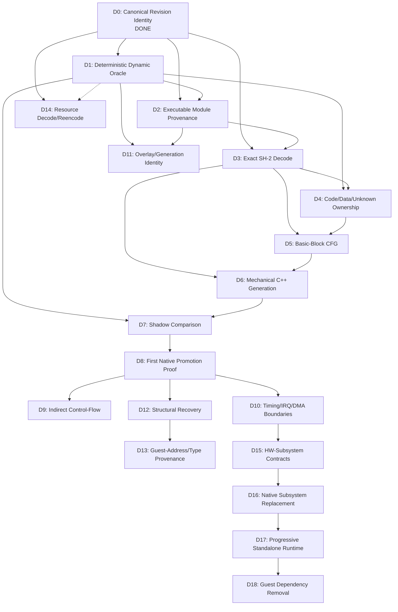

# Development Plan

Status: `ADOPTED`

This document defines the capability-oriented development sequence for The Story of Thor 2 native recovery. Each milestone describes what the project gains, not which external tool it imitates.

For the method/component experiment and adoption gates that feed into these milestones, see `PIPELINE_VALIDATION_PLAN.md`.

## Planning audit summary

This plan was created during the T2-P0 planning checkpoint after completing T2-M0. The audit of the prior planning model found:

1. **ROADMAP.md milestones conflated capability with technology.** M1 was named after SaturnAutoRE rather than the capability (dynamic oracle). If SaturnAutoRE failed, the milestone appeared to fail, even though the capability was still needed.
2. **PIPELINE_VALIDATION_PLAN.md served as both development plan and verification plan.** The target chain was a single paragraph; the phases were verification experiments doubling as roadmap milestones.
3. **External projects were embedded in phase identity.** The capability should be primary; the external project is merely one candidate method.
4. **Phase ordering was partly historical, not dependency-driven.** Some phases could be reordered based on actual dependencies.
5. **Phase 8 (SaturnRecomp) bundled 8 independent sub-experiments** that are needed at very different times.
6. **Verification experiments had hidden prerequisites** not represented in the plan.
7. **No fallback routes were specified** for any development capability.
8. **ROADMAP.md and PIPELINE_VALIDATION_PLAN.md had overlapping scope** with no clear authority boundary.

This dual-track model separates development capabilities from verification experiments. A failed external method does not invalidate the development capability it was meant to enable.

## Plan status classification

### Method / Decision States (Verification Track)
Used when evaluating an external technique, tool, or component:
- `PROPOSED` — initial idea, not yet tested or adopted.
- `TESTING` — bounded experiment is actively executing.
- `VALIDATED` — experiment has demonstrated the concept on a Thor 2 slice.
- `ADOPT` — project decision to include in the production pipeline.
- `ADOPT_PARTIAL` — only the proven, bounded part enters.
- `SUPERSEDED` — replaced by a newer plan or approach.
- `REJECT` — tested and found unsuitable for Thor 2.
- `DEFER` — potentially useful but intentionally postponed.

`VALIDATED` describes evidence. `ADOPT` describes a project decision. They are separate.

### Capability Scope States (Development Track)
Used to track how much of a development capability has been proven:
- `PROPOSED` — capability defined, no verification started.
- `READY_FOR_BOUNDED_TEST` — preconditions and slice bounded, ready to test.
- `BOUNDED_PROOF` — verified on at least one specific slice/path/range.
- `EXPANDED_PROOF` — verified across multiple modules/subsystems.
- `DONE` — verified across the agreed required Thor 2 workload.

**Core Rule:** `V-xx PASS` does NOT automatically imply `Dxx DONE`. An experiment pass establishes evidence only for its exact revision, CPU, module/range, workload/window, configuration, and observation contract.

A development capability may be `ADOPTED` as necessary even when the proposed method for achieving it is `REJECTED`.

## Dependency overview



### Dependency groups

**Core translation chain** (sequential critical path):
D0 → D1 → D2 → D3 → D4 → D5 → D6 → D7 → D8

**Scaling and hardening** (after D8):
D9 (indirect flow), D10 (timing boundaries), D11 (overlays)

**Recovery** (after D8):
D12 (structural), D13 (type provenance)

**Resource track** (parallel, from D0; D1 needed for runtime loading/semantics):
D14 (resource decode/reencode)

**Hardware track** (after D1 + D10):
D15 (contract discovery), D16 (native replacement)

**Integration** (final stages):
D17 (standalone runtime), D18 (guest removal)

Note: D11 (overlay detection) may need to move earlier if D2 discovers runtime code replacement.

### Critical path to first mechanical proof (D8)

For a single basic-block proof, not all milestones need full completion:

1. **D0 (Substrate):** Provides canonical bytes and candidate load addresses. (`DONE`)
2. **D1 (Dynamic Oracle):** Bounded oracle capability via `V-01-core`. At least one reproducible observation under pinned configuration. (`BOUNDED_PROOF`)
3. **D2 (Module Provenance):** Bounded provenance via `V-02a` for `0TH2.BIN` at `0x06004000`. (`BOUNDED_PROOF`)
4. **D3 (SH-2 Decode & L0 Semantics):** Target-subset readiness: exact decode for the target block plus verified L0 instruction/memory semantics. (`BOUNDED_PROOF`)
5. **D4 / D5 (Ownership & CFG):** Completed instruction bytes in the target block are `CONFIRMED_CODE`; CFG bounded for the block. (`BOUNDED_PROOF`)
6. **Pre-D8 Executable Identity Guard:** Eligibility bound to revision, CPU, address range, content identity, and validity scope. Any RAM change invalidates native dispatch.
7. **Pre-D8 Minimum Event Safety (`PRE_D8_MINIMUM_EVENT_SAFETY`):** Verified absence of observable machine event boundaries (IRQ, DMA, dual-CPU, delay-slot edge cases) for the selected block.
8. **D6 (Mechanical C++ Generation):** Generates explicit-state C++ for the target block (`V-07A`).
9. **D7 (Shadow Comparison):** Shadow comparison infrastructure verified with negative controls (`V-07B`).
10. **D8 (Native Promotion Proof):** Zero-divergence shadow execution followed by authoritative native override (`V-07C`).

The first proof targets a RAM-only Master SH-2 block from `0TH2.BIN` without MMIO, DMA, or interrupt boundary crossings.

---

## ASM-First Recovery Strategy and FULL_ASM_GAME_GATE (ADR D-015)

Per architectural decision **ADR D-015**, the project enforces an **ASM-FIRST recovery strategy** before broad C++ translation of game code.

### Intended Sequence

```text
original Saturn binaries
→ complete executable/module provenance
→ complete CODE/DATA/UNKNOWN recovery
→ complete exact SH-2 assembly reconstruction
→ reassemblable game
→ rebuilt Saturn game boots and runs in Mednafen (FULL_ASM_GAME_GATE)
→ only then broad systematic ASM → C++ translation.
```

### Treatment of Existing C++ Blocks

- Bounded C++ blocks `bb_06004000` (D8) and `bb_06004280` (D9) are retained strictly as **bounded technology/proof specimens**.
- They prove that the SH-2 instruction decoder, explicit-state mechanical code generator, shadow comparator, and authoritative native dispatcher work correctly under real Saturn hardware execution.
- They will NOT be deleted.
- Broad mechanical translation of game code into C++ is **FROZEN / BLOCKED** until `FULL_ASM_GAME_GATE` passes.
- Do NOT broaden native C++ translation now.
- Do NOT start M-03 implementation (SaturnAutoRE harvester) now.

### Mandatory Gate: FULL_ASM_GAME_GATE

Advancement from assembly reconstruction to broad systematic C++ translation requires passing `FULL_ASM_GAME_GATE`.

Required evidence:
1. **All Executable Modules Known or Explicitly UNKNOWN:** Complete inventory of executable files and overlays (`0TH2.BIN`, `TH2.LOW`, overlays).
2. **Runtime Provenance:** Proven disc-to-memory loading path and execution range for each module and overlay generation.
3. **Complete CODE/DATA/UNKNOWN Classification:** Every byte in executable regions classified with explicit evidence; no gaps.
4. **Exact SH-2 Decoding:** Every confirmed instruction decoded bit-exact with proven semantics.
5. **Assembly Reconstruction:** Labels, CFG, branches, calls, and returns recovered sufficiently to emit assemblable `.s` source files.
6. **Data & Literal Pool Preservation:** Literal pools, jump tables, and embedded data preserved without displacement or corruption.
7. **No Guessed Instructions:** UNKNOWN bytes are emitted strictly as raw data directives (`.byte`), NEVER as speculative instructions.
8. **Deterministic Reassembly:** Every reconstructed module can be assembled deterministically by candidate toolchain.
9. **Rebuilt Module Layout Validation:** Section layout, load addresses, and file structures match original binary specifications.
10. **Game Substitution:** Original game disc files can be replaced by rebuilt equivalents.
11. **Cold-Boot Execution:** Rebuilt Saturn game boots from cold boot in clean pinned Mednafen debug oracle.
12. **Title & Gameplay:** Rebuilt game reaches title screen and playable gameplay.
13. **Runtime Parity:** Bounded runtime checkpoints match original un-rebuilt execution.
14. **Overlay Proof:** Overlays and dynamic modules are included in the reassembly and boot verification.

### Round-Trip Evidence Hierarchy

The project defines the following formal evidence classes for assembly reconstruction:
- `ASM_BYTE_EXACT`: Reassembled binary reproduces original retail bytes bit-for-bit (0 byte differences).
- `ASM_LAYOUT_EXACT`: Reassembled binary reproduces identical section layout, memory mapping, symbol alignments, and file sizes, even if padding or build artifacts differ deterministically.
- `ASM_RUNTIME_VERIFIED`: Replaced binary runs in runtime oracle and matches all architectural state, register, and memory checkpoints.
- `ASM_GAME_BOOT_VERIFIED`: Rebuilt disc/game successfully completes Saturn boot sequence in clean Mednafen without hangs or assertion failures.
- `ASM_GAMEPLAY_VERIFIED`: Rebuilt game reaches title screen and controllable gameplay with full functional parity.

*Rule:* Semantic equivalence must NEVER be called byte-exact.

### Generated Assembly Project Layout

The planned assembly project structure is:
```text
asm/
  modules/       # Main executable modules (e.g. 0TH2.BIN, TH2.LOW)
  overlays/      # Dynamic overlays and staged execution overlays
  include/       # Shared assembly headers, macros, hardware equates
  generated/     # Tool-generated assembly slices with provenance tags
  linker/        # Linker scripts, memory maps, layout definitions
  manifests/     # Module hashes, section offset maps, provenance manifests
```

### Mechanical Assembly Generation Rules

Assembly generation must be strictly mechanical:
- **Confirmed Instructions:** Emit exact SH-2 instruction representation (e.g., `mov.l @(h'0008, PC), r5`).
- **Data:** Emit exact bytes/words/longs or appropriate lossless directives (`.byte`, `.word`, `.long`, `.ascii`, `.incbin`).
- **UNKNOWN:** Emit lossless raw data directives (`.byte 0x..`), NEVER guessed instructions.
- **Provenance Tags:** Every emitted range must retain provenance metadata:
  `module`, `runtime address`, `source offset`, `generation/overlay identity`, `original bytes/hash`.

### Toolchain Selection Rules

- Assembler and linker tooling must be selected ONLY after a bounded reproducibility experiment.
- Do NOT assume GNU `as` or any other tool can reproduce the original layout out of the box.
- Test candidate tooling against already-proven small regions first (e.g. `bb_06004000` / `bb_06004280`).
- Required process: assemble → compare bytes/layout → diagnose differences.
- **Strict Legal Hygiene:** Never commit or download proprietary/leaked Sega SDK binaries or copyrighted assemblers.

### First ASM-First Bounded Experiment

The immediate next technical task is defined as the first bounded ASM round-trip experiment:
- Select an already-proven small region/module slice (e.g. `bb_06004000` or `bb_06004280`);
- Emit generated SH-2 `.s` assembly with mechanical directives and provenance tags;
- Assemble using candidate open toolchain;
- Perform byte and layout comparison;
- Substitute rebuilt bytes into live memory / module;
- Execute in clean Mednafen oracle;
- Verify runtime parity against baseline execution.

### Status of M-03

- **Technical capability:** `READY_FOR_BOUNDED_TEST` (technically unblocked by D9.4 proof).
- **Execution status:** `DEFERRED_BY_ASM_FIRST_ARCHITECTURE` until `FULL_ASM_GAME_GATE` passes.
- M-03 is NOT technically disproven, but its execution is postponed in accordance with the ASM-first sequencing rule.

---

## Development milestones

### D0 — Canonical Revision Identity

```
ID:              D0
CAPABILITY:      Immutable, reproducible identification of the Thor 2 disc image and its files.
WHY REQUIRED:    Every later claim requires knowing exactly which bytes are being analyzed.
PREREQUISITES:   None.
INPUTS:          Private disc image.
DELIVERABLE:     Revision config, ISO9660 manifest with per-file SHA-256, boot metadata, executable candidate list.
WHAT MUST BE TRUE BEFORE START: Access to private disc image.
WHAT THIS MILESTONE DOES NOT ATTEMPT: Dynamic execution, code classification, semantic naming.
REQUIRED VERIFICATION GATE: Two independent census runs produce identical output.
FALLBACK / ALTERNATIVE ROUTE: N/A — foundational.
STATUS:          DONE (T2-M0, commit 5a0de2f)
```

### D1 — Deterministic Dynamic Oracle

```
ID:              D1
CAPABILITY:      Reproducible dynamic observation of Thor 2 execution: CPU state, PC, memory effects from a fixed starting state.
WHY REQUIRED:    All behavioral claims require dynamic proof. No translation can be verified without an authoritative execution path.
PREREQUISITES:   D0.
INPUTS:          Canonical disc image, emulator/instrumentation.
DELIVERABLE:     Environment producing deterministic execution traces; at least one reproducible observation contract.
WHAT MUST BE TRUE BEFORE START: D0 DONE; pinned emulator candidate and boot recipe identified.
WHAT THIS MILESTONE DOES NOT ATTEMPT: Translation, boundary discovery, subsystem implementation, broad coverage, or TH2.LOW provenance.
REQUIRED VERIFICATION GATE: V-01-core (bounded emulator observation). V-01-automation is an optional later sub-gate.
FALLBACK / ALTERNATIVE ROUTE: If SaturnAutoRE automation fails, use Mednafen core directly (ADOPT_PARTIAL). If Mednafen fails, test raw BizHawk or another instrumented emulator.
STATUS:          BOUNDED_PROOF (V-01-core passed; decision D-009)
```

### D2 — Executable Module Provenance

```
ID:              D2
CAPABILITY:      Confirmed mapping: disc file → load address → runtime execution range.
WHY REQUIRED:    Must know what code is at what address before translating it. Without provenance, we cannot bind disc bytes to runtime behavior.
PREREQUISITES:   D0, D1 (bounded dynamic oracle).
INPUTS:          Disc manifest (D0), dynamic oracle traces (D1).
DELIVERABLE:     Provenance records per executable path; detection of transformation/relocation. Provenance progresses in stages: V-02a (0TH2.BIN), V-02b (TH2.LOW).
WHAT MUST BE TRUE BEFORE START: D1 provides working oracle.
WHAT THIS MILESTONE DOES NOT ATTEMPT: Full overlay system implementation, resource decoding, code translation.
REQUIRED VERIFICATION GATE: V-02a (0TH2.BIN provenance), V-02b (TH2.LOW provenance). V-10 contributes if transformation is detected.
COMPLETION RULE: One provenance path PASS equals D2 BOUNDED_PROOF for that path, not all provenance DONE. Falsified mapping is a valid evidence result.
FALLBACK / ALTERNATIVE ROUTE: Manual Mednafen tracing if Daytona-style model does not fit.
STATUS:          PROPOSED
```

### D3 — Exact SH-2 Decode

```
ID:              D3
CAPABILITY:      Correct decoding and instruction/memory semantics for SH-2 opcodes in Thor 2.
WHY REQUIRED:    Translation requires correct instruction decode and execution semantics.
PREREQUISITES:   D0 (bytes), D2 (confirmed code ranges with load addresses, transitively providing D1 dynamic evidence).
INPUTS:          Confirmed code ranges, SH-2 ISA documentation, executed opcode corpus.
DELIVERABLE:     Decoder implementation and L0 semantic test suite. Staged capability:
                 - D3 target-subset readiness: exact decode for one bounded translated block
                 - D3 BOUNDED_PROOF: verified decode for executed target corpus
                 - D3 EXPANDED_PROOF: larger executed-opcode corpus
                 - D3 DONE: agreed required executed Thor 2 opcode corpus covered
WHAT MUST BE TRUE BEFORE START: At least one confirmed code range with known load address.
WHAT THIS MILESTONE DOES NOT ATTEMPT: Translation to C++, semantic naming, function discovery.
REQUIRED VERIFICATION GATE: V-06 (independent decoder cross-check) + explicit L0 semantic test suite.
L0 SEMANTIC GATE: Decode correctness is strictly separate from instruction execution semantics and memory access semantics. Target instruction subset requires independent synthetic edge-case tests (arithmetic flags, T bit, sign/zero extension, narrow registers, PC-relative, GBR, PR, MACH/MACL, delay slots, big-endian loads/stores, alignment, ordered memory effects, MMIO classification).
FALLBACK / ALTERNATIVE ROUTE: Multiple independent reference decoders exist (Catherine, Mednafen internals, SH7604 manual).
STATUS:          BOUNDED_PROOF (Expanded to JSR @Rn in D9.1)
```

### D4 — Code/Data/Unknown Ownership

```
ID:              D4
CAPABILITY:      Per-byte classification of module contents as CONFIRMED_CODE, PROBABLE_CODE, UNKNOWN, PROBABLE_DATA, CONFIRMED_DATA, CODE_AND_DATA, or PADDING.
WHY REQUIRED:    Must distinguish code from data before translation. Translating data as code produces nonsense; skipping code produces gaps.
PREREQUISITES:   D3 (decoder), D1 (executed-range evidence).
INPUTS:          Decoded instruction streams, dynamic execution traces.
DELIVERABLE:     Classified ownership map for bounded module ranges. Dynamic execution establishes CONFIRMED_CODE for completed instruction bytes in bounded context without prematurely classifying surrounding bytes as data.
WHAT MUST BE TRUE BEFORE START: Decoder working on target range; at least one execution trace showing completed instruction fetches.
WHAT THIS MILESTONE DOES NOT ATTEMPT: Whole-module classification upfront, function boundary assignment, semantic naming.
REQUIRED VERIFICATION GATE: V-03 (bounded candidate batch) and/or V-04 (segmentation schema).
FALLBACK / ALTERNATIVE ROUTE: Dynamic execution evidence alone classifies executed bytes as CONFIRMED_CODE for bounded translation.
STATUS:          BOUNDED_PROOF (Expanded to bb_06004280 in D9.1)
```

### D5 — Basic-Block CFG Construction

```
ID:              D5
CAPABILITY:      Control flow graph at basic-block granularity for confirmed code ranges.
WHY REQUIRED:    Translation unit is the basic block. Block boundaries must be known to generate correct C++.
PREREQUISITES:   D3 (decoded instructions), D4 (code ranges identified).
INPUTS:          Decoded code with ownership classification.
DELIVERABLE:     CFG for bounded confirmed-code ranges. Bounded block CFG construction does not require whole-module completion.
WHAT MUST BE TRUE BEFORE START: Code ranges classified; decoder produces correct branch/jump targets for target block.
WHAT THIS MILESTONE DOES NOT ATTEMPT: Function grouping, full indirect target resolution, semantic naming.
REQUIRED VERIFICATION GATE: Dynamic execution must agree with static CFG for observed paths.
FALLBACK / ALTERNATIVE ROUTE: Manual CFG construction for small ranges.
STATUS:          BOUNDED_PROOF (Expanded to bb_06004280 in D9.1)
```

### D6 — Mechanical Explicit-State C++ Generation

```
ID:              D6
CAPABILITY:      Generate C++ that preserves all SH-2 architectural state for basic blocks.
WHY REQUIRED:    Core capability — transform executed SH-2 code into verifiable native code.
PREREQUISITES:   D3 (decode + L0 semantics), D5 (CFG/block boundaries), PRE_D8_EXECUTABLE_IDENTITY_GUARD, PRE_D8_MINIMUM_EVENT_SAFETY.
INPUTS:          Decoded basic blocks with confirmed boundaries and verified L0 semantics.
DELIVERABLE:     C++ source for at least one block preserving R0-R15, PC, SR, PR, GBR, VBR, MACH, MACL, and ordered memory effects under L0 semantic contract.
PRE-D8 GUARDS:   - Executable identity guard: eligibility bound to revision, CPU, address range, content identity, and validity scope. Any RAM change invalidates native dispatch; no silent guest cache alteration.
                 - Minimum event safety: verified absence of observable machine event boundaries (IRQ, DMA, dual-CPU, delay-slot edge cases) for the selected candidate.
WHAT MUST BE TRUE BEFORE START: Target block decode and L0 semantics proven; pre-D8 guards satisfied.
WHAT THIS MILESTONE DOES NOT ATTEMPT: Semantic naming, native type introduction, optimization, function-level grouping.
REQUIRED VERIFICATION GATE: V-07A (generated transition proof).
FALLBACK / ALTERNATIVE ROUTE: If code generation approach fails for a candidate, interpreter-only path remains authoritative.
STATUS:          BOUNDED_PROOF for bb_06004000 and bb_06004280 (technology specimen; broad C++ translation frozen per ADR D-015 until FULL_ASM_GAME_GATE)
```

### D7 — Shadow Comparison Infrastructure

```
ID:              D7
CAPABILITY:      Run generated C++ alongside oracle and compare CPU/memory state after every block.
WHY REQUIRED:    Verification requires automated comparison — manual state checking does not scale.
PREREQUISITES:   D1 (oracle), D6 (generated C++).
INPUTS:          Generated C++ blocks, oracle execution path.
DELIVERABLE:     Infrastructure with verified negative controls that detects any divergence in CPU state or memory effects. Oracle path and candidate path start from isolated equivalent pre-states rather than sharing mutable post-state.
WHAT MUST BE TRUE BEFORE START: At least one generated block and working oracle; negative controls proven.
WHAT THIS MILESTONE DOES NOT ATTEMPT: Automatic divergence repair, broad coverage, optimization.
REQUIRED VERIFICATION GATE: V-07B (shadow checker validation with negative controls).
FALLBACK / ALTERNATIVE ROUTE: Manual state comparison for very small initial proofs if infrastructure is blocked.
STATUS:          BOUNDED_PROOF (bb_06004000 / V-07B passed)
```

### D8 — First Native Promotion Proof

```
ID:              D8
CAPABILITY:      One basic block executing natively with zero divergence from oracle.
WHY REQUIRED:    Central proof that the project methodology works. Without this, everything downstream is speculative.
PREREQUISITES:   D6 (generated C++ with pre-D8 guards), D7 (shadow comparison with verified checker).
INPUTS:          Shadow-verified block with zero divergence.
DELIVERABLE:     Proof that native execution produces identical state to oracle for one block, with real native dispatch and execution continuation.
WHAT MUST BE TRUE BEFORE START: Shadow comparison shows zero divergence for candidate block; checker negative controls pass.
WHAT THIS MILESTONE DOES NOT ATTEMPT: Broad coverage, optimization, semantic recovery, multi-block chaining.
REQUIRED VERIFICATION GATE: V-07C (real native override proof).
COMPLETION RULE: D8 BOUNDED_PROOF applies strictly to the tested candidate block under its declared contract; does not imply all blocks are safe.
FALLBACK / ALTERNATIVE ROUTE: If the first block candidate fails, try a simpler block. If ALL blocks fail, re-examine decode/generation/oracle correctness.
STATUS:          BOUNDED_PROOF for bb_06004000 (technology specimen; broad C++ translation frozen per ADR D-015 until FULL_ASM_GAME_GATE)
```

### D9 — Indirect Control-Flow Handling

```
ID:              D9
CAPABILITY:      Strategy for blocks containing indirect jumps, calls, or computed branches.
WHY REQUIRED:    Real game code uses jump tables, function pointers, and vtable-like dispatches. These cannot be statically resolved.
PREREQUISITES:   D8 (basic proof first), D1 (dynamic target observation).
INPUTS:          Dynamic traces showing indirect target sets, static analysis of jump table patterns.
DELIVERABLE:     Runtime dispatch mechanism or evidence-based target resolution for at least one indirect-flow block.
WHAT MUST BE TRUE BEFORE START: Basic promotion proof exists for direct-flow blocks.
WHAT THIS MILESTONE DOES NOT ATTEMPT: Complete target-set resolution (UNKNOWN targets stay on interpreter/fallback).
REQUIRED VERIFICATION GATE: At least one indirect-flow block handled correctly in shadow comparison.
FALLBACK / ALTERNATIVE ROUTE: Interpreter fallback for all indirect flow until evidence is sufficient.
STATUS:          BOUNDED_PROOF for bb_06004280 (technology specimen; broad C++ translation frozen per ADR D-015 until FULL_ASM_GAME_GATE; M-03 DEFERRED_BY_ASM_FIRST_ARCHITECTURE)
```

### D10 — Timing/Interrupt/DMA Execution Boundaries

```
ID:              D10
CAPABILITY:      Classification of blocks that cross timing-sensitive or non-atomic boundaries.
WHY REQUIRED:    A block assumed atomic might be interrupted; DMA can modify memory asynchronously; device-visible writes have timing requirements.
PREREQUISITES:   D1 (can observe interrupts/DMA), D8 (basic proof exists).
INPUTS:          Dynamic traces showing interrupt entry points, DMA register access patterns, device-visible write timing.
DELIVERABLE:     Policy for handling non-atomic blocks; classification of which execution ranges are timing-sensitive.
WHAT MUST BE TRUE BEFORE START: Dynamic oracle can observe interrupt/DMA patterns.
WHAT THIS MILESTONE DOES NOT ATTEMPT: Full Saturn timing model; subsystem replacement.
REQUIRED VERIFICATION GATE: Timing-sensitive blocks handled without divergence in shadow comparison.
FALLBACK / ALTERNATIVE ROUTE: Conservative fallback for all timing-sensitive blocks.
STATUS:          PROPOSED
```

### D11 — Overlay/Generation Identity

```
ID:              D11
CAPABILITY:      Detection and handling of runtime code replacement at a given address.
WHY REQUIRED:    If RAM is repopulated with different code, block identity must include generation. Without this, translated code may execute against wrong-generation data.
PREREQUISITES:   D1 (dynamic oracle), D2 (provenance model).
INPUTS:          Dynamic traces over extended gameplay showing memory content stability.
DELIVERABLE:     Evidence of whether Thor 2 uses code overlays; generation tracking model if so.
WHAT MUST BE TRUE BEFORE START: Oracle can trace extended gameplay beyond boot.
WHAT THIS MILESTONE DOES NOT ATTEMPT: Complete overlay map (incremental discovery); premature overlay handling for unobserved ranges.
REQUIRED VERIFICATION GATE: V-10 (transformed executable detection).
FALLBACK / ALTERNATIVE ROUTE: If no overlays found, model simplifies to stable identity. If found, generation tracking is added.
STATUS:          PROPOSED
```

Note: D11 position may shift earlier if D2 discovers runtime code replacement during provenance work.

### D12 — Structural Recovery

```
ID:              D12
CAPABILITY:      Evidence-backed function boundaries, call graphs, data structure identification.
WHY REQUIRED:    Moving from flat blocks to higher-level structures enables comprehension and more efficient translation.
PREREQUISITES:   D8 (proven mechanical base ensures correctness is not sacrificed for structure).
INPUTS:          Verified blocks, CFG, dynamic call traces, library signature candidates.
DELIVERABLE:     Function boundaries and call graph with evidence for at least one module range.
WHAT MUST BE TRUE BEFORE START: Mechanical translation proof exists; correctness is protected.
WHAT THIS MILESTONE DOES NOT ATTEMPT: Gameplay semantics, speculative naming without evidence.
REQUIRED VERIFICATION GATE: V-05 (Ghidra/signatures for library support); V-13 (AI-assisted recovery).
FALLBACK / ALTERNATIVE ROUTE: Manual analysis; address-based names retained until evidence supports semantic names.
STATUS:          PROPOSED
```

### D13 — Guest-Address/Type Provenance

```
ID:              D13
CAPABILITY:      Typed native structures that preserve original guest address provenance.
WHY REQUIRED:    Transitioning from flat guest memory to typed C++ structures is necessary for maintainability, but premature abstraction loses provenance and breaks verification.
PREREQUISITES:   D12 (structural recovery provides confirmed structures).
INPUTS:          Confirmed data structures with evidence.
DELIVERABLE:     Type system with GuestAddress/GuestPtr preserving provenance for at least one confirmed structure.
WHAT MUST BE TRUE BEFORE START: At least one structure has evidence-backed field identification.
WHAT THIS MILESTONE DOES NOT ATTEMPT: Premature abstraction of unknown structures; removal of guest address tracking.
REQUIRED VERIFICATION GATE: V-09 (Azel address provenance model).
FALLBACK / ALTERNATIVE ROUTE: Remain on flat guest addresses if typed views are premature.
STATUS:          PROPOSED
```

### D14 — Resource Decoding/Reencoding

```
ID:              D14
CAPABILITY:      Understand and byte-accurately round-trip game resources (graphics, audio, maps, scripts, text).
WHY REQUIRED:    A standalone native implementation must load and use game resources without the Saturn CD subsystem.
PREREQUISITES:   D0 (disc files). D1 is NOT an unconditional prerequisite for pure structural resource round-trip when static evidence is sufficient. D1 is required only for runtime loading, consumer behavior, transformation, and semantic meaning.
INPUTS:          Disc files, and optionally runtime resource-loading traces.
DELIVERABLE:     Byte-accurate decode/reencode for at least one resource type. BYTE_ROUNDTRIP_EXACT requires zero byte differences; lossy or normalized re-encoding cannot claim exact status. Decoded semantic fields must be distinguished from opaque byte preservation.
WHAT MUST BE TRUE BEFORE START: Static resource format candidate identified or D1 loading observed.
WHAT THIS MILESTONE DOES NOT ATTEMPT: Resource modification, enhancement, or format replacement.
REQUIRED VERIFICATION GATE: V-11 (round-trip proof); V-12 (patch differential mining for locating resources).
FALLBACK / ALTERNATIVE ROUTE: Keep resources as opaque binary blobs passed to emulated subsystems.
STATUS:          PROPOSED
```

Note: D14 can proceed on a parallel track from D0 for static round-trip, with D1 added when analyzing runtime loading and consumer semantics.

### D15 — Hardware-Subsystem Contract Discovery

```
ID:              D15
CAPABILITY:      Documented contracts for Saturn hardware subsystems as actually used by Thor 2.
WHY REQUIRED:    Native subsystem replacement requires knowing the exact contract. Building a general Saturn emulator is a non-goal.
PREREQUISITES:   D1 (dynamic oracle), D10 (timing/DMA boundary understanding).
INPUTS:          Extended dynamic traces of hardware register access, DMA patterns, interrupt behavior.
DELIVERABLE:     Documented contracts for VDP1, VDP2, SCU, SCSP/M68K, CD, SMPC as used by Thor 2.
WHAT MUST BE TRUE BEFORE START: Extended dynamic observation of hardware interaction available.
WHAT THIS MILESTONE DOES NOT ATTEMPT: Implementation of replacement subsystems; general Saturn hardware documentation.
REQUIRED VERIFICATION GATE: V-08 (SaturnRecomp component testing) for cross-reference; independent Saturn documentation for validation.
FALLBACK / ALTERNATIVE ROUTE: Keep emulated subsystems where contract is not yet understood.
STATUS:          PROPOSED
```

### D16 — Native Subsystem Replacement

```
ID:              D16
CAPABILITY:      Replace one Saturn hardware subsystem with a native implementation verified against oracle.
WHY REQUIRED:    Eventual standalone runtime requires native subsystems.
PREREQUISITES:   D15 (documented subsystem contract).
INPUTS:          Subsystem contract, oracle for verification.
DELIVERABLE:     Native implementation of one subsystem passing differential tests against oracle.
WHAT MUST BE TRUE BEFORE START: Subsystem contract documented and verified.
WHAT THIS MILESTONE DOES NOT ATTEMPT: All subsystems at once; premature optimization.
REQUIRED VERIFICATION GATE: Differential testing against oracle on representative Thor 2 workload.
FALLBACK / ALTERNATIVE ROUTE: Keep emulated subsystem.
STATUS:          PROPOSED
```

### D17 — Progressive Standalone Runtime

```
ID:              D17
CAPABILITY:      Game execution with measurably reduced emulator/oracle dependency.
WHY REQUIRED:    The project goal is a native implementation, not permanent emulator dependence.
PREREQUISITES:   Sufficient verified block coverage (D8+), at least one native subsystem (D16).
INPUTS:          Verified native blocks and subsystems.
DELIVERABLE:     Game execution path with reduced oracle dependency, quantified coverage.
                 Scope distinguishes:
                 1. Isolated extraction proof (subsystem compiles/links standalone);
                 2. Integrated bounded runtime proof (subsystem runs within game loop);
                 3. Measured dependency reduction (quantified decrease in emulated cycles/subsystems);
                 4. Final agreed dependency/coverage completion.
                 No isolated subsystem experiment implies standalone-game completion.
WHAT MUST BE TRUE BEFORE START: Critical mass of verified blocks and at least one native subsystem.
WHAT THIS MILESTONE DOES NOT ATTEMPT: Complete emulator removal; areas not yet proven safe remain on fallback.
REQUIRED VERIFICATION GATE: V-14 (progressive standalone extraction).
FALLBACK / ALTERNATIVE ROUTE: Hybrid runtime with more emulator dependency where needed.
STATUS:          PROPOSED
```

### D18 — Guest CPU/Hardware Dependency Removal

```
ID:              D18
CAPABILITY:      Native game implementation without guest CPU/hardware emulation where proven safe.
WHY REQUIRED:    Final project goal.
PREREQUISITES:   D17 with sufficient proven coverage and documented safety.
INPUTS:          Proven standalone runtime with quantified remaining dependencies.
DELIVERABLE:     Game running natively where proven safe; remaining dependencies documented.
WHAT MUST BE TRUE BEFORE START: Coverage and verification sufficient for safe removal in each area.
WHAT THIS MILESTONE DOES NOT ATTEMPT: Forced removal of dependencies that are not yet proven safe.
REQUIRED VERIFICATION GATE: L5 externally observable equivalence for removed dependencies.
FALLBACK / ALTERNATIVE ROUTE: Keep bounded emulator components where proof is insufficient.
STATUS:          PROPOSED
```

---

## Risk/proof map

For each critical uncertainty: when it becomes blocking and what can safely proceed before resolution.

### Master vs Slave SH-2 execution

```
RISK:            If Slave SH-2 executes game code, mechanical translation needs dual-CPU semantics.
WHY IT MATTERS:  Dual-CPU complicates scheduling, memory visibility, and verification.
EARLIEST POINT WE MUST RESOLVE IT: D1 — dynamic oracle can observe which CPUs execute game code.
WHAT EVIDENCE RESOLVES IT: Trace showing Slave SH-2 PC values executing game logic (or only bounded worker tasks, or never).
WHAT CAN SAFELY PROCEED BEFORE IT IS RESOLVED: All single-CPU mechanical work; first proof targets Master SH-2 only.
```

### Executable Low WRAM provenance

```
RISK:            TH2.LOW mapping to 0x002DA000 might be wrong, transformed, or relocated.
WHY IT MATTERS:  Second major code range; wrong mapping = wrong translation base.
EARLIEST POINT WE MUST RESOLVE IT: D2 — module provenance confirmation.
WHAT EVIDENCE RESOLVES IT: Dynamic trace: CD read → RAM write at 0x002DA000 → later instruction fetch from that range.
WHAT CAN SAFELY PROCEED BEFORE IT IS RESOLVED: All work on 0TH2.BIN (independent provenance from Saturn header).
```

### Overlays/runtime code replacement

```
RISK:            Code at a given address may change during gameplay.
WHY IT MATTERS:  Block identity must include generation if code changes; without this, translations may execute against wrong-generation content.
EARLIEST POINT WE MUST RESOLVE IT: D2 (discovered during provenance) or D11 (formalized).
WHAT EVIDENCE RESOLVES IT: Multiple traces at same PC range showing same or different instruction bytes over time.
WHAT CAN SAFELY PROCEED BEFORE IT IS RESOLVED: First proof on boot-time resident code (low overlay risk).
```

### Decompression/transformation before execution

```
RISK:            Disc file bytes may not equal runtime bytes if transformation occurs before execution.
WHY IT MATTERS:  Provenance model must include transformation nodes if disc ≠ RAM.
EARLIEST POINT WE MUST RESOLVE IT: D2.
WHAT EVIDENCE RESOLVES IT: Byte comparison of disc file extent with RAM content at candidate load address.
WHAT CAN SAFELY PROCEED BEFORE IT IS RESOLVED: 0TH2.BIN — first-read, likely direct-loaded by Saturn BIOS.
```

### Indirect control flow

```
RISK:            Jump tables, function pointers, and computed branches cannot be statically resolved.
WHY IT MATTERS:  Untranslated targets must remain on interpreter/fallback; complete static coverage is impossible.
EARLIEST POINT WE MUST RESOLVE IT: D9 (after first proof).
WHAT EVIDENCE RESOLVES IT: Dynamic traces showing indirect target sets; table analysis for jump tables.
WHAT CAN SAFELY PROCEED BEFORE IT IS RESOLVED: First proof uses direct-flow blocks only.
```

### Emulator/oracle correctness

```
RISK:            Mednafen may not match real Saturn hardware behavior.
WHY IT MATTERS:  If oracle is wrong, all behavioral proofs based on it are wrong.
EARLIEST POINT WE MUST RESOLVE IT: D1 (baseline) plus ongoing for critical semantics.
WHAT EVIDENCE RESOLVES IT: Match with Saturn documentation; independent emulator or real hardware comparison for critical semantics.
WHAT CAN SAFELY PROCEED BEFORE IT IS RESOLVED: Most work proceeds with documented emulator version; critical semantics get two independent checks.
```

### SH-2 decode/semantic correctness

```
RISK:            Incorrect instruction decode produces incorrect translation.
WHY IT MATTERS:  Foundation of all mechanical work.
EARLIEST POINT WE MUST RESOLVE IT: D3 + V-06 + L0 semantic test suite.
WHAT EVIDENCE RESOLVES IT: Multiple independent decoders agree on executed Thor 2 opcode corpus AND independent synthetic edge-case tests pass for execution/memory semantics.
WHAT CAN SAFELY PROCEED BEFORE IT IS RESOLVED: Nothing involving translation.
```

### Interrupt/timing boundaries

```
RISK:            A block assumed atomic might be interrupted mid-execution by Saturn IRQ or VBlank.
WHY IT MATTERS:  If a translated block modifies state that an ISR expects to see partially updated, behavioral divergence occurs.
EARLIEST POINT WE MUST RESOLVE IT: PRE_D8_MINIMUM_EVENT_SAFETY (for candidate block) and D10 (general scaling).
WHAT EVIDENCE RESOLVES IT: Dynamic traces showing ISR entry points, frequencies, and which code ranges are interrupted; verified absence of event boundaries for candidate block.
WHAT CAN SAFELY PROCEED BEFORE IT IS RESOLVED: Target blocks verified under PRE_D8_MINIMUM_EVENT_SAFETY.
```

### SCU DMA interaction

```
RISK:            DMA transfers modify memory asynchronously; code depending on DMA completion needs synchronization.
WHY IT MATTERS:  Translated code reading from a DMA destination before transfer completes would see stale data.
EARLIEST POINT WE MUST RESOLVE IT: D10/D15.
WHAT EVIDENCE RESOLVES IT: DMA register write patterns, completion polling, and interrupt-driven completion.
WHAT CAN SAFELY PROCEED BEFORE IT IS RESOLVED: All code that does not depend on DMA-destination memory.
```

### VDP1/VDP2 hardware-visible boundaries

```
RISK:            Graphics commands have specific timing requirements relative to VBlank and HBlank.
WHY IT MATTERS:  Incorrect VDP register access timing produces visual glitches or hangs.
EARLIEST POINT WE MUST RESOLVE IT: D15.
WHAT EVIDENCE RESOLVES IT: VDP register access patterns correlated with VBlank/HBlank timing.
WHAT CAN SAFELY PROCEED BEFORE IT IS RESOLVED: All non-VDP code translation.
```

### M68K/SCSP dependence

```
RISK:            Sound system runs on separate CPU (68000) with its own program.
WHY IT MATTERS:  SH-2 → M68K communication has specific synchronization; native audio requires understanding the M68K program.
EARLIEST POINT WE MUST RESOLVE IT: D15.
WHAT EVIDENCE RESOLVES IT: Communication register patterns, M68K program identity, SCSP configuration.
WHAT CAN SAFELY PROCEED BEFORE IT IS RESOLVED: All SH-2 game logic translation (sound can remain emulated).
```

### CD streaming

```
RISK:            CD access has latency and buffering that game code may depend on.
WHY IT MATTERS:  Native runtime needs an alternative to the Saturn CD subsystem.
EARLIEST POINT WE MUST RESOLVE IT: D15.
WHAT EVIDENCE RESOLVES IT: CD access patterns (sector reads, streaming setup, status polling).
WHAT CAN SAFELY PROCEED BEFORE IT IS RESOLVED: All non-CD code; CD can remain emulated.
```

### Legal/private artifact handling

```
RISK:            Accidentally committing copyrighted material to GitHub.
WHY IT MATTERS:  Legal compliance is priority 1. Repository purge would be disruptive.
EARLIEST POINT WE MUST RESOLVE IT: Ongoing publication gate.
WHAT EVIDENCE RESOLVES IT: .gitignore covers binary extensions; external/README.md documents rules; however, .gitignore alone is not permanent proof. Future traces, generated C++, JSON/YAML exports, debugger dumps, and logs may contain copyrighted material even under allowed extensions. Every artifact must pass content-level review prior to commit.
WHAT CAN SAFELY PROCEED BEFORE IT IS RESOLVED: Always safe with mandatory pre-commit content review.
```

---

## Development/verification coupling matrix

Every development capability that relies on an unproven method points to a verification gate. A failed method does not invalidate the capability.

```
D0  Canonical Revision Identity     → no external method needed (DONE)
D1  Deterministic Dynamic Oracle    → V-01-core (bounded emulator observation)
                                      V-01-automation (optional later sub-gate)
                                      if V-01 fails: capability persists; test another emulator
D2  Executable Module Provenance    → V-02a (0TH2.BIN) + V-02b (TH2.LOW) + V-10 (transformation)
                                      if V-02 fails: manual tracing; provenance still needed
D3  Exact SH-2 Decode               → V-06 (Catherine cross-check) + L0 semantic test suite
                                      if V-06 fails: use other references; decode still needed
D4  Code/Data/Unknown Ownership     → V-03 (bounded candidate batch) + V-04 (segmentation schema)
                                      if both fail: manual classification; ownership still needed
D5  Basic-Block CFG                  → V-03 (contributes)
                                      if V-03 fails: manual CFG for small ranges
D6  Mechanical C++ Generation        → V-07A (transition proof) + PRE_D8 identity/event guards
                                      if V-07A fails: re-examine approach; generation still needed
D7  Shadow Comparison                → V-07B (shadow checker validation with negative controls)
D8  First Native Promotion Proof     → V-07C (real native override proof)
D9  Indirect Control-Flow            → no specific external experiment; extends D8
D10 Timing/IRQ/DMA Boundaries        → no specific external experiment; extends D1
D11 Overlay/Generation Identity      → V-10 (Baroque overlay lessons)
                                      if V-10 fails: direct observation via D1
D12 Structural Recovery              → V-05 (Ghidra/signatures) + V-13 (AI recovery)
                                      if both fail: manual analysis
D13 Guest-Address/Type Provenance    → V-09 (Azel model)
                                      if V-09 fails: stay on flat addresses
D14 Resource Decode/Reencode         → V-11 (exact round-trip) + V-12 (patch mining)
                                      D0 sufficient for static; D1 for runtime semantics
D15 HW-Subsystem Contracts           → V-08 (SaturnRecomp components a-h) for cross-reference
                                      if V-08 fails: document contracts from own traces
D16 Native Subsystem Replacement     → V-08 (components that pass)
                                      if V-08 fails: build from scratch using D15 contracts
D17 Progressive Standalone Runtime   → V-14 (standalone extraction)
D18 Guest Dependency Removal         → extends D17
```

---

## Failure scenario resilience

**Scenario A — SaturnAutoRE does not work:** D1 capability persists. Try raw Mednafen, BizHawk, or another emulator. The project needs a dynamic oracle, not specifically SaturnAutoRE.

**Scenario B — TH2.LOW is transformed before execution:** D2 provenance model gains transformation nodes. V-10 formalizes this. Architecture does not change.

**Scenario C — Slave SH-2 never executes during relevant workload:** D10 simplifies; dual-CPU complexity is removed for that workload. The plan does not assume dual-CPU; it tests for it.

**Scenario D — Slave SH-2 executes only as bounded worker:** Architecture models it as deterministic virtual execution per ARCHITECTURE.md. Native replacement deferred until the worker contract is understood.

**Scenario E — Mechanical block diverges due to interrupt timing:** D7 shadow comparison detects the divergence. D10 classifies the block as timing-sensitive. The block stays on fallback. The verification plan rejects/splits rather than patches.

**Scenario F — Ghidra finds hundreds of unexecuted apparent functions:** D4 ownership keeps them UNKNOWN or PROBABLE_CODE until executed. V-05 rules prevent Ghidra labels from becoming behavioral truth.

**Scenario G — SaturnRecomp useful subsystem but wrong scheduler assumptions:** V-08 adopts only the bounded component. Scheduler remains project-owned. ADOPT_PARTIAL.

**Scenario H — AI produces cleaner C++ but loses guest provenance:** D13 requires provenance preservation. V-13 rules prevent semantic promotion without evidence. The AI output is rejected or constrained.
